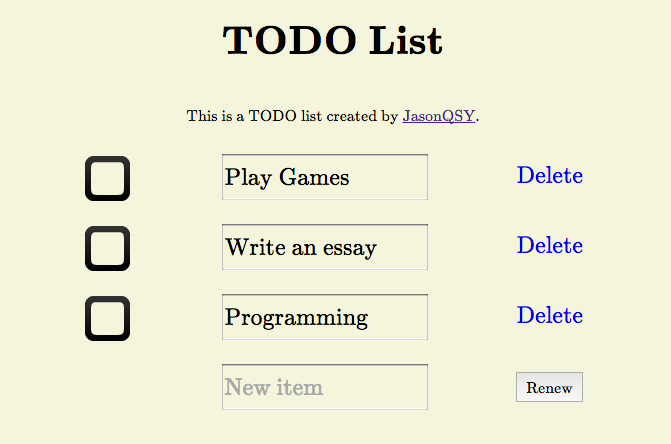

# TodoList

This is a web todolist and dyweb php assignment of [Restful API](http://dyweb.github.io/course/web/2016_Spring/html-rest/index.html).

Meanwhile, the front-end is based on the previous version in branch `php-assignment`.



## Usage

With php, set up a localhost or a server. A easy way to set up a localhost is
```
git clone https://github.com/JasonQSY/TodoList.git && cd TodoList
php -S localhost:8080 -t ./src/
```
I reccommend that open <http://localhost:8080/index.php> with Google Chrome.

## Structure

- index.php
    - It is mainly a html file to display contents. If not log in, redirect to `login.php`
- default.css
    - The only css file.
- process.php
    - When edit something one index.php, it will redirect to `process.php` to deal with the issue and return to `index.php` to display.
- todolist.php
    - A PHP class offering relatively low-level operations on the TodoList.
- login.php
    - The front-end of login. If having logged in, redirect to `index.php` directly. If register or login, redirect to `result.php`.
- result.php
    - If registering or logging in successfully, redirect to `index.php`.
- logout.php
    - Unset session and redirect to `login.php`

